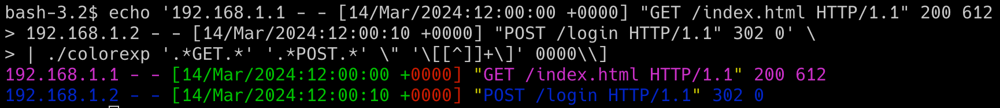

# Colorexp
**Colorexp** is a command line tool that allows coloring of text matches from standard input with multiple colors,
something that is not easy to achieve with tools like `grep` and `less`.

**Colorexp**
- uses the Go regexp format, as documented [here](https://pkg.go.dev/regexp/syntax).
- supports overlapping matches (the color of the first matching pattern will be used)

# Usage
```
Usage: colorexp [options] patterns...
-F, --fixed-strings   Don't interpret regular expression metacharacters.
-h, --help            Display this help and exit.
-H, --highlight       Color by changing the background color.
-i, --ignore-case     Perform case insensitive matching.
```
## Example


# Installation

## Homebrew on MacOS
```sh
brew tap EugenDueck/tap https://github.com/EugenDueck/homebrew-tap
brew install colorexp
```

## All OSes
- Download a Release from https://github.com/EugenDueck/colorexp/releases

# Build
```sh
go build colorexp.go
```
