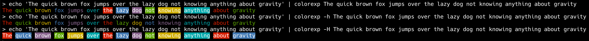

# Colorexp
**Colorexp** is a command line tool that allows coloring of text matches from standard input with multiple colors,
something that is not easy to achieve with tools like `grep` and `less`.

**Colorexp**
- uses the Go regexp format, as documented [here](https://pkg.go.dev/regexp/syntax).
- supports overlapping matches (the color for the last pattern that matches will be used)

# Usage
```
Usage: colorexp [options] patterns...
  -f, --full-match-highlight    Highlight the entire match, even if pattern contains capturing groups.
  -F, --fixed-strings           Do not interpret regular expression metacharacters.
  -i, --ignore-case             Perform case insensitive matching.
  -h, --no-highlight            Do not color by changing the background color.
  -H, --only-highlight          Only color by changing the background color.
  -g, --vary-group-colors-off   Turn off changing of colors for every capturing group. Defaults to on if exactly one pattern is given.
  -G, --vary-group-colors-on    Turn on changing of colors for every capturing group. Defaults to on if exactly one pattern is given.
```
## Examples

### Basic Usage
- use the `-h`/`-H` options to only colorize the text, or only the background



### Overlapping matches - last match wins
- all matches are colorized, and the color of the last match will be used


### Capturing groups
- when using capturing groups, only the matched group contents will be colorized
#### Vary colors of groups in patterns
- when exactly one pattern is given, the default is to use different colors for each capturing group
  - in case of multiple patterns, the `-G` option can be used to enforce varying of the colors for each group


#### Use the same color for all groups of a pattern
- when multiple patterns are given, the default is to use the same colors for all capturing groups of a pattern
    - in case of a single pattern, the `-g` option can be used to enforce use of a single color


# Installation

## Homebrew on MacOS
```sh
brew tap EugenDueck/tap https://github.com/EugenDueck/homebrew-tap
brew install colorexp
```

## All OSes
- Download a Release from https://github.com/EugenDueck/colorexp/releases

# Build
```sh
go build colorexp.go
```
